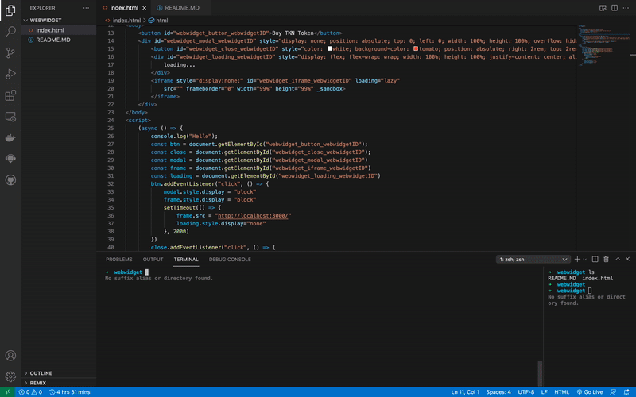

# WEB WIDGET DEMO

Demo website for webwidget

## Local Dev

- Clone this repository
- start a web app on `PORT 3000`
- Open the folder in VS code or cd into the repo folder
- Install live server on vs code and open index.html with live server or run `python -m http.server 8000` to serve the html file
- Navigate to the base url in your browser

## DEMO

